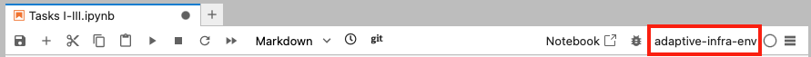
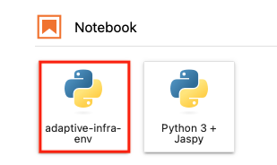

# IECDT Adaptive Infrastructure lab

## Quick start

1. Clone this repository
   ```bash
   git clone git@github.com:alisonpeard/iecdt-adaptive-infra.git
   ```
1. Get the tutorial data by:
   * Downloading it from [here](https://drive.google.com/drive/folders/1pU8Y6sm2FxZVFJTiemxBPr_-c33OhaGy)
   * Copying it from `/gws/nopw/j04/iecdt/adaptive-infra/data`
1. Make the environment (adapted from [here](https://help.jasmin.ac.uk/docs/interactive-computing/creating-a-virtual-environment-in-the-notebooks-service/))

   To get started, open the [JASMIN notebooks service](https://notebooks.jasmin.ac.uk/) and in the launcher click the "Terminal" button. A bash shell will appear.

   

   First, make a directory in which to store your virtual environments. You can put this wherever you like, as long as you reference the same place later. You could store several virtual environments within this directory, for different purposes. Then, change into that directory

   ```bash
   mkdir ~/pyenvs
   cd ~/pyenvs
   ```

   Next, create a new empty virtual environment. Including the `--system-site-packages` argument will allow you to add packages on top of `jaspy`, rather than starting completely from scratch. Activate `adaptive-infra-env` to allow you to install packages.

   ```bash
   python -m venv adaptive-infra-env --system-site-packages
   source adaptive-infra-env/bin/activate
   ```

   To use the virtual environment as a Jupyter Notebook kernel, install `ipykernel` using pip.

   ```bash
   python -m pip install ipykernel
   python -m ipykernel install --user --name=adaptive-infra-env
   ```

   To install the required packages for this tutorial, navigate back to the tutorial repository cloned in Step 1 and use pip to install from the `requirements.txt` file.

   ```bash
   cd ~/iecdt-adaptive-infra
   python -m pip install -r requirements.txt
   ```

   You can then choose `adaptive-infra-env` from the Jupyter Notebook homepage, or from the top right of any open notebook.

   
   
